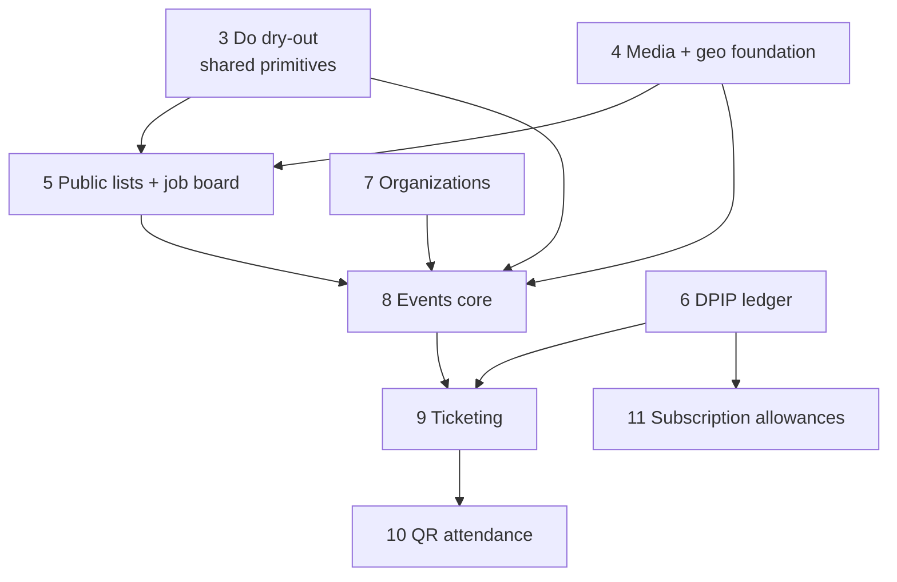

# Dupip Roadmap — Do consolidation → Be events & ticketing

Consolidated program plan. Supersedes `docs/do-rebuild-plan.md` (kept for history; Phases 1–2
of that document are **already merged on this branch**).

One file per phase. Each phase is one PR unless stated otherwise.

## Status

| # | Phase | Scope | Status | File |
|---|-------|-------|--------|------|
| 1 | Do — model + API + migrations | RRULE cadence, simplified budgets, thin routes, migrations 0017–0019 | ✅ done | `../do-rebuild-plan.md` §Phase 1 |
| 2 | Do — frontend rebuild | doPage/doView/taskGrid/forms rebuilt on plain SWR | ✅ done | `../do-rebuild-plan.md` §Phase 2 |
| 3 | Do dry-out + shared primitives | Kill remaining duplication, extract ownership/social/public-page/date kits | ✅ done (PR stacked on #483) | `phase-03-do-dry-out.md` |
| 4 | Media, storage & geolocation foundation | iDrive e2 uploads, compression, EXIF, Google Places, map, Write composer | ⬜ planned | `phase-04-media-geo-foundation.md` |
| 5 | Public list profiles + job board | Public list pages, public tasks as job posts, applications | ⬜ planned | `phase-05-public-lists-job-board.md` |
| 6 | DPIP ledger & wallets | Off-chain authoritative balances, atomic transfers, wallet at signup | ⬜ planned | `phase-06-dpip-ledger.md` |
| 7 | Organizations | Clerk Orgs mirror, org profiles/lists/wallets, polymorphic ownership | ⬜ planned | `phase-07-organizations.md` |
| 8 | Events core | Event model, event pages, `/app/be/events` listing, RSVP/social | ⬜ planned | `phase-08-events-core.md` |
| 9 | Ticketing & checkout | Tiers, promo windows, bundles, buy/reserve with DPIP, escrow | ⬜ planned | `phase-09-ticketing.md` |
| 10 | QR attendance & door control | Rotating signed QR, scanner API + UI, attendance records, pay-at-door | ⬜ planned | `phase-10-qr-attendance.md` |
| 11 | Subscription DPIP allowances | Plan catalog, Clerk billing webhook + cron top-ups, idempotent grants | ⬜ planned | `phase-11-subscription-allowances.md` |

## Dependency graph



Phases 3, 4, 6 are independent of each other and can run in parallel. 7 can start any time after 3.
9 is the only hard blocker for 10. 11 only needs 6.

## Confirmed decisions

1. **DPIP ledger** — an authoritative **off-chain ledger** (`Wallet.balance` + double-entry
   `LedgerEntry` rows behind every `Transaction`) is the source of truth. Kaleido stays for
   on-chain mint/NFT and becomes an optional mirror reconciled later (`Transaction.onChainTxHash`,
   `Wallet.onChainSyncedAt`). No Kaleido call is on the critical path of a ticket purchase.
2. **Organizations** — Clerk Organizations remain the identity/membership source of truth
   (already used by chat via `ChatOrgMembership`). We add a Prisma `Organization` mirror and a
   polymorphic owner (`ownerType: USER | ORG` + `orgId`) on `Profile`, `List`, `Event`, `Wallet`.
3. **Data preservation** — every destructive schema change ships with an idempotent migration in
   `src/migrations/` and snapshots dropped fields into a `legacy Json?` column (established in
   Phases 1–2). Next free migration number: **0020**.
4. **Delivery** — one PR per phase, each self-verifiable with `npx prisma generate && npm run build
   && npm run lint` plus the manual checklist at the end of each phase file.
5. **Money is never trusted from the client** — prices, discounts, deposits and balances are
   recomputed server-side on every write (existing rule for job earnings; extended to tickets).

## Cross-cutting conventions (apply to every phase)

- **Routes** are thin: `await auth()` → resolve internal `User` → authorize → call a service in
  `src/lib/services/**` → return `{ resource }` or `{ error }`. No business logic in route files.
- **Sanitize** all user text with `sanitizeText`/`sanitizeHTML` from `@/lib/utils/sanitize`.
- **Docs** — every new/changed route updates `src/app/api/openapi.yaml` and the nearest
  `CLAUDE.md`; every new view directory gets a `CLAUDE.md`.
- **i18n** — new copy goes to `src/locales/en.json` first, then propagates to all 33 locales via
  the `the-i18n` skill / `scripts/translate-new-keys.js`. No hardcoded strings in components.
- **Money type** — all DPIP amounts are persisted as **integer minor units** (`Int`, 1 DPIP =
  100 units). Prisma-on-Mongo has no `Decimal`, and `Float` balances drift under `$inc` and break
  `{ gte: amount }` comparisons, so no monetary value is ever stored as a float. Conversion happens
  only at the API/UI boundary via `src/lib/utils/money.ts` (Phase 6). Existing float money fields
  (`User.stash`, `Job.earnings`, …) are out of scope and stay as they are; new value-bearing fields
  are minor units.
- **Schema validity per phase** — Prisma requires both sides of a relation in the same schema, so a
  relation field is only added in the phase that introduces both models. Where a later phase adds
  the counterpart (e.g. `Event.tiers` in Phase 9), the earlier phase's schema block omits it and
  the later phase's file states the inverse fields it must add.
- **Idempotency** — any endpoint that moves value (transfer, purchase, check-in, allowance grant)
  takes or derives an idempotency key persisted as `Transaction.reference @unique`.
- **Visibility** — reuse `src/lib/services/visibility/visibilityService.ts`
  (`buildVisibilityWhereClause`, `batchEnrichUserProfiles`) for every new public feed query.

## Verification ritual (per PR)

```bash
npx prisma generate
npm run build
npm run lint
node src/migrations/<new-migration>.js   # dev DB, then re-run to prove idempotency
```

Then the phase's manual checklist. Commits via the `the-committer` skill; migrations via
`the-migrator`; locale fan-out via `the-i18n`.

## Risks tracked across the program

| Risk | Mitigation | Phase |
|------|-----------|-------|
| Float drift on balances | Integer minor units everywhere + ledger reconciliation job | 6 |
| Partial writes when money moves | Interactive `prisma.$transaction` on the Atlas replica set wraps every debit+credit+entries+status; a recovery sweep resumes abandoned `PENDING` rows | 6, 9, 10 |
| Overselling tickets | Conditional claim on **both** `TicketTier.sold` and `Event.soldCount` inside the checkout transaction; reservations expire via cron | 9 |
| QR screenshot sharing | Rotating HMAC token bound to a per-ticket secret, single-use check-in, fail-closed offline | 10 |
| Nullable `@unique` slugs are not sparse on Mongo | Slugs are required and generated at creation, never null | 5, 7, 8 |
| Clerk billing event names differ per Clerk version | Webhook handler is event-name tolerant + daily cron reconciles **against Clerk's own subscription list**, not just local mirrors | 11 |
| Disguised uploads served from our origin | Magic-byte inspection server-side + isolated media origin with forced download/`Content-Security-Policy` headers | 4 |
| Vercel 4.5 MB body limit | Presigned direct-to-S3 uploads | 4 |
| 33 locales × new keys per phase | en.json is source of truth, scripted fan-out | all |
| Legacy `Event` (life events) colliding with public events | Rename to `LifeEvent` with a copy-then-delete migration | 8 |
