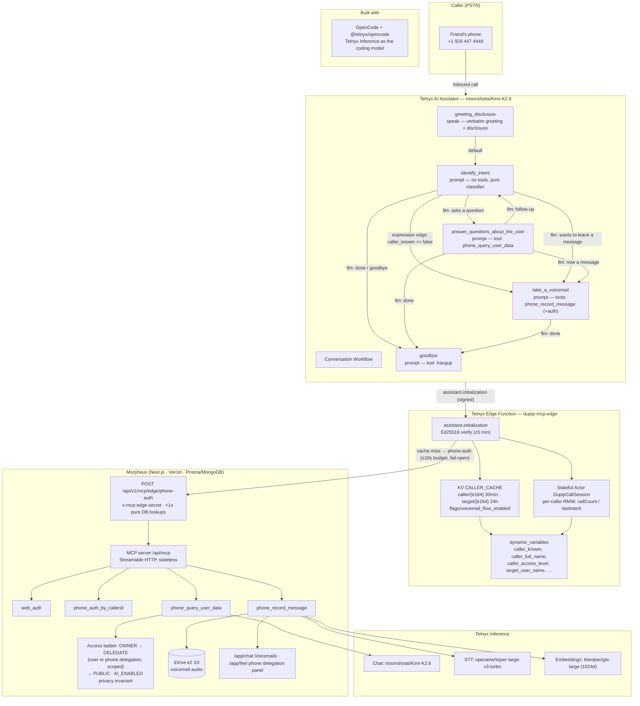

# Dupip — AI Assistant & Edge Compute Coding Challenge

**A phone number your friends can call to catch up with you — asynchronously.**

Dupip users keep their lives in the app (days, moods, tasks, notes). The Dupip
Personal Assistant gives that life a phone number: a friend dials in, the
assistant greets them **by name and by the name of the person whose number they
dialed**, answers questions about the user's week/month/year **at the access
level the caller is entitled to** (owner / delegated scopes / public only), or
takes a voicemail that lands in the user's `/app/chat` as playable audio +
transcript + summary.

Built end-to-end on the Telnyx platform: AI Assistant + Conversation Workflow,
a custom **MCP server** (4 tools), **Dynamic Webhook Variables** served by a
**Telnyx Edge Function** that uses **KV** and a **Stateful Actor**, and
**Telnyx Inference** for the voice model, STT, and summaries.

---

## Live endpoints

| What | Where |
|---|---|
| Phone number to call | **+1 (929) 447-4448** |
| Edge Function (dynamic variables webhook) | `https://dupip-mcp-edge-afd30602-9.telnyxcompute.com` |
| MCP server | `https://www.dupip.com/api/mcp` (Streamable HTTP, spec 2025-06-18) |
| Assistant | `assistant-f01f7462-229b-49d1-b828-e4358b328e3d` ("Dupip Personal Assistant") |
| Web app (voicemails, phone delegation panel) | `https://www.dupip.com` → `/app/chat` → Voicemails, `/app/feel` → third-party |

Demo caller numbers: `+44 7537 154448` (delegated, labeled **"Mom"**) and
`+55 84 99448 6969` (not delegated — exercises the unknown-caller path).

---

## Architecture



### Data flow, call by call

1. **Inbound call** → assistant fires `assistant.initialization` (Ed25519-signed) at the Edge Function.
2. Edge verifies the signature, reads **KV** (`caller/{e164}` 30-min TTL, `target/{e164}` 24-h TTL) in parallel; on a miss it calls morpheus `/api/v1/mcp/edge/phone-auth` inside the 10 s webhook window (fail-open to voicemail-only if morpheus is unreachable — the call must never drop).
3. **Stateful Actor** records the call per caller (single-threaded RMW → exact `call_count`).
4. Edge returns `dynamic_variables` — all **strings** (the platform silently rejects responses containing non-string values).
5. The greeting speaks the **target user's name**; the `expression` edge routes on `caller_known == "false"` deterministically to voicemail; LLM edges route intent.
6. Mid-call, tools hit the **MCP server** with `_meta.telnyx_conversation_id`; morpheus re-derives the true caller from the conversations API (never trusts the LLM), re-validates the access ladder, and queries days/notes through the RAG pipeline.

---

## Challenge requirement → where it lives

| Requirement | Implementation |
|---|---|
| **1. Conversation Workflow** | 5 nodes: 1 speak (verbatim greeting + recording disclosure), 4 prompts; 1 default edge, **1 variable-comparison expression edge** (`caller_known == "false"`), 7 LLM-condition edges |
| **2. MCP Server (≥3 tools)** | **4 tools**: `web_auth`, `phone_auth_by_callerid`, `phone_query_user_data`, `phone_record_message` — registered on the assistant with a per-assistant allowlist |
| **3. Dynamic Webhook Variables** | Edge Function returns 9 variables: identity, access level, call count, target name, feature flag — they drive the greeting **and** the deterministic routing edge |
| **4a. Edge Functions** | `dupip-mcp-edge`, shipped with `telnyx-edge ship` — `https://dupip-mcp-edge-afd30602-9.telnyxcompute.com` |
| **4b. KV** | caller cache (30 min) **and** target cache (24 h) = cached responses; `flags/voicemail_flow_enabled` = feature flag |
| **4c. Stateful Actors** | `DupipCallSession` per caller number: `recordCall()` RMW of `{callCount, lastCallAt, lastIntent}` — a counter that would need a lock anywhere else |
| **5. Telnyx Inference via OpenCode** | See [Development workflow](#development-workflow) below |
| **6. Public deployment + docs** | This README, the phone number above, the demo script below |

**Stretch goals hit:** variable-comparison edges ✓ · KV feature flags ✓ · custom
dynamic variables ✓ · S3-compatible object storage for recordings ✓ (iDrive e2)
· secondary assistant bound to a second number ✓ (`+1 380 209 4448`,
"Dupip - Talk to your friend").

---

## Development workflow (dogfooding)

```bash
# Install the Telnyx Inference plugin for OpenCode
opencode plugin @telnyx/opencode

# Authenticate with the Telnyx API key
opencode auth login --provider telnyx --method "API Key"

# Verify models are available
opencode run --model 'telnyx/moonshotai/Kimi-K2.6' 'Hello from Telnyx inference!'
opencode auth list   # confirm the credential is stored
```

Models used across the solution (runtime): assistant + phone-query generation
`moonshotai/Kimi-K2.6`, STT `openai/whisper-large-v3-turbo`, embeddings
`thenlper/gte-large` (1024-dim, OpenAI-compatible endpoint
`POST /v2/ai/openai/embeddings`). The RAG keeps a **recency fallback** so
retrieval degrades gracefully — which saved the demo when the DeepSeek
embeddings API was discontinued mid-build (good Q&A story: the fallback kept
answers flowing, then we validated Telnyx's own embeddings as the replacement).

---

## Setup / redeploy

### Edge Function (`edge/dupip-mcp-edge`)

```bash
telnyx-edge auth api-key set <key>
cd edge/dupip-mcp-edge
telnyx-edge secrets add MORPHEUS_BASE_URL "https://www.dupip.com"
telnyx-edge secrets add MORPHEUS_EDGE_SECRET "<secret>"        # = MCP_EDGE_SECRET in morpheus
telnyx-edge secrets add TELNYX_WEBHOOK_PUBLIC_KEY "<ed25519>"  # Mission Control → Keys & Credentials
telnyx-edge ship                     # ~4-5 min, monitors the rollout
telnyx-edge logs dupip-mcp-edge --since 1h
```

Manifest (`telnyx.toml`): single umbrella file with `[edge_compute]` (func id),
`[storage.kv.CALLER_CACHE]` (namespace id), `[[secrets]]` × 3,
`[[ratelimits]]` (120/60 s), `[[actors]]` binding `CALL_SESSION` →
`DupipCallSession`. Run `telnyx-edge types` after manifest changes.

### Assistant (Assistants API)

- `dynamic_variables_webhook_url` → the Edge Function URL
- `dynamic_variables_webhook_timeout_ms: 10000`
- `dynamic_variables` declared defaults (9 keys, all strings — **the platform
  rejects non-string values and silently drops the whole response**)
- `mcp_servers: [{ id, allowed_tools: [phone_auth_by_callerid,
  phone_query_user_data, phone_record_message] }]`
- Nodes: `identify_intent` has no tools (fewer tools = more reliable
  classifier); `take_a_voicemail`/`answer_questions_about_the_user` use
  `tools_mode: "append"` (assistant toolset applies); `goodbye` attaches the
  shared hangup tool via `shared_tool_ids`.

### Morpheus (MCP server + voicemails + delegation panel)

```bash
npm ci --legacy-peer-deps
npx prisma generate && npx prisma db push   # run against the prod DB too
# env: MCP_SERVICE_KEY, MCP_PUBLIC_ORIGIN, MCP_EDGE_SECRET, MCP_CLERK_OAUTH_*,
#      TELNYX_API_KEY, TELNYX_INFERENCE_MODEL, TELNYX_STT_MODEL, DEEPSEEK_API_KEY
```

---

## Demo script (8–10 minutes)

> Have the web app open in two tabs: `/app/chat` → Voicemails and `/app/feel` →
> third-party. Keep Mission Control open on the assistant's Live Calls view.

1. **(0:00) Setup in 30 s** — "This is Dupip. Users keep their life in the app;
   I gave it a phone number. The architecture: assistant workflow → Edge
   Function → KV + Actor → MCP server in our Next.js app. I'll call it from a
   number we delegated in the third-party panel."
2. **(1:00) Dynamic variables** — call `+1 929 447 4448` from the delegated
   number. Point at the greeting: *"Hi Mom, you've reached Angelo Reale
   Caldeira de Lemos's personal assistant…"* — name + caller name resolved by
   the Edge Function on the initialization webhook; show the edge logs
   (`resolved in …ms via phone-auth`, `response dynamic_variables={…}`).
3. **(3:00) Deterministic routing (expression edge)** — call from the
   non-delegated number: greeting says "Hi friend…", and the router goes
   straight to voicemail — `caller_known == "false"` is a variable-comparison
   edge, not an LLM guess.
4. **(4:30) MCP in the conversation** — back on the delegated call, ask *"how
   was my week?"* → `phone_query_user_data` fires (visible in Live Calls);
   the answer comes from real days/notes at the delegated access level. Ask
   something out of scope → the assistant says it can't see that (privacy
   ladder).
5. **(6:30) Voicemail → app** — leave a message; the assistant calls
   `phone_record_message`; refresh `/app/chat` → Voicemails: transcript +
   summary appear, then the audio player fills in (recording pulled from the
   Telnyx recordings API by `call_session_id` — the assistant connection has
   no event webhook, so we attach lazily).
6. **(8:00) Edge primitives** — Mission Control: the Actor's `call_count`
   incremented per caller across calls; the KV flag `voicemail_flow_enabled`
   toggles the flow without a redeploy.

## Walkthrough & decision review (7–10 minutes)

- **Why this use case** — async catch-up: friends shouldn't need an app to
  know how you're doing, and voicemails shouldn't die in a carrier mailbox.
- **Workflow design** — speak node where the message must be verbatim
  (greeting + "this call may be recorded"); a tool-less classifier node for
  intent; one node per capability so each node carries only its tools.
  `instructions_mode`: `replace` on the router (clean slate), `append` on the
  capability nodes.
- **Expression edge vs LLM edges** — `caller_known` is a fact: route it
  deterministically. Intent ("ask a question" vs "leave a message") is
  semantic: LLM edges. That's the whole routing philosophy: *facts get
  variable comparisons, meaning gets LLM conditions.*
- **Stateful Actor vs KV vs plain logic** — the per-caller `call_count` is a
  read-modify-write that races across webhook calls: **Actor** (single-threaded
  per entity, exactly its job). Caller/target identity is read-heavy,
  recomputable data: **KV cache** (30 min / 24 h TTLs — the 24 h target cache
  keeps `target_user_name` resolving even when morpheus is unreachable). The
  feature flag is configuration, not data: **KV**. Nothing in a database that
  doesn't need to be.
- **MCP design** — stateless Streamable HTTP (Vercel serverless has no shared
  memory; a session map would 404 on cold starts). Auth: service key for the
  assistant, Clerk OIDC for web clients (`web_auth`). **True caller identity
  always re-derived from `_meta.telnyx_conversation_id`** — never from
  LLM-supplied arguments (prompt-injection resistant).
- **Privacy ladder** — OWNER → DELEGATE (user or phone delegation, scope-mapped)
  → PUBLIC, re-validated on every tool call; AI-enabled notes only surface for
  the owner or an explicit AI_ENABLED/PRIVATE grant.
- **Error handling** — webhook fail-open (call proceeds as voicemail-only,
  never drops), best-effort KV writes (a KV credential hiccup can't downgrade
  a successful lookup), idempotent voicemail rows on `telnyx_conversation_id`,
  recency fallback in RAG.
- **Tradeoffs** — 10 s webhook window vs cold-start latency (we cache
  aggressively and keep the phone-auth call inside the budget); per-node MCP
  filtering isn't in the API, so nodes rely on `tools_mode` + instruction
  scoping; phone grants resolve per-target because one number can be delegated
  by several users.

## Q&A prep

- *"What if the edge is down?"* — fail-open: `caller_known=false` → voicemail
  path; calls never drop. Variables fall back to declared defaults.
- *"How does a stranger get answers?"* — they don't: PUBLIC tier = public
  notes + public profile only; AI-enabled notes are opt-in-gated (privacy
  invariant covered by negative tests).
- *"Why not a session map in the MCP server?"* — serverless statelessness:
  fresh server + transport per request, no `Mcp-Session-Id` churn.
- *"How do recordings reach S3 without an event webhook?"* — the assistant's
  managed connection is read-only via the API, so we pull recordings by
  `call_session_id` when the recipient opens the inbox (throttled: ≥3 min
  between attempts, max 6).
- *"What bit you during the build?"* — three platform lessons, all documented
  in the code: non-string dynamic-variable values reject the whole webhook
  response; portal edits reset node tool configs and declared variables
  (re-PATCH via API); KV runtime tokens can expire (treat KV writes as
  best-effort).

## Submission checklist

- [x] GitHub repository with the complete solution (morpheus + `edge/dupip-mcp-edge`)
- [x] Live Edge Function URL — `https://dupip-mcp-edge-afd30602-9.telnyxcompute.com`
- [x] Phone number for testing — `+1 (929) 447-4448`
- [x] README.md with setup instructions and architecture overview (this file)
- [x] Demo script (above)
- [ ] `opencode.jsonc` showing the Telnyx plugin active (see `opencode auth list`)

## Docs

[Edge Functions](https://developers.telnyx.com/docs/edge-compute/quickstart) ·
[KV](https://developers.telnyx.com/docs/edge-compute/kv) ·
[Stateful Actors](https://developers.telnyx.com/docs/edge-compute/stateful-actors) ·
[Bindings](https://developers.telnyx.com/docs/edge-compute/runtime/bindings) ·
[Workflows](https://developers.telnyx.com/docs/inference/ai-assistants/workflows) ·
[Dynamic variables](https://developers.telnyx.com/docs/inference/ai-assistants/dynamic-variables) ·
[Assistants API](https://developers.telnyx.com/api-reference/assistants/create-an-assistant) ·
[MCP spec](https://modelcontextprotocol.io/) ·
[@telnyx/opencode](https://www.npmjs.com/package/@telnyx/opencode)
